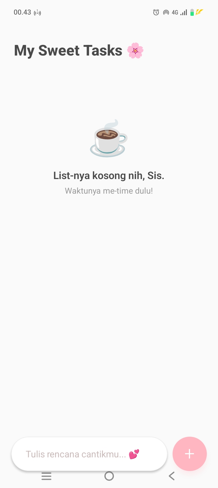

# 🌸 MyTaskList App - Mini Project P07

Aplikasi Task Manager sederhana yang dibangun menggunakan **React Native** dan **Expo** dengan sentuhan desain *Soft Pastel Aesthetic*.

## 👩‍🎓 Identitas Mahasiswa
* **Nama:** Indri Amalia
* **NIM:** 243303621204

## 📝 Deskripsi Aplikasi
MyTaskList App adalah aplikasi pengelola tugas harian yang dirancang untuk membantu produktivitas dengan antarmuka yang bersih dan feminin. Aplikasi ini mengintegrasikan seluruh materi dari P01 hingga P06, mulai dari komponen dasar hingga manajemen list dinamis.

## ✨ Fitur yang Diimplementasikan
- [x] **Setup & Running:** Project dibuat menggunakan `npx create-expo-app`.
- [x] **Komponen Dasar:** Penggunaan View, Text, TouchableOpacity, dan StyleSheet.
- [x] **State Management:** Implementasi `useState` untuk input dan array data task.
- [x] **Form Input:** Validasi input (tidak boleh kosong) dengan `KeyboardAvoidingView`.
- [x] **List Dinamis:** Menggunakan `FlatList` dengan `keyExtractor` dan `ListEmptyComponent`.
- [x] **Fitur CRUD:** Menambah tugas baru dan menghapus tugas.
- [x] **Bonus:** Fitur "Mark as Done" (checklist selesai).
- [x] **Bonus:** Counter tugas selesai dari total tugas.
- [x] **Bonus:** UI Estetik dengan tema Soft Pastel.

## 📸 Screenshots
> **Wajib:** Lampirkan screenshot aplikasi dari HP fisik kamu di sini.

## 🚀 Cara Menjalankan
1. Clone repository ini.
2. Jalankan `npm install` atau `yarn install`.
3. Jalankan `npx expo start`.
4. Scan QR Code menggunakan aplikasi **Expo Go** di HP fisik.
